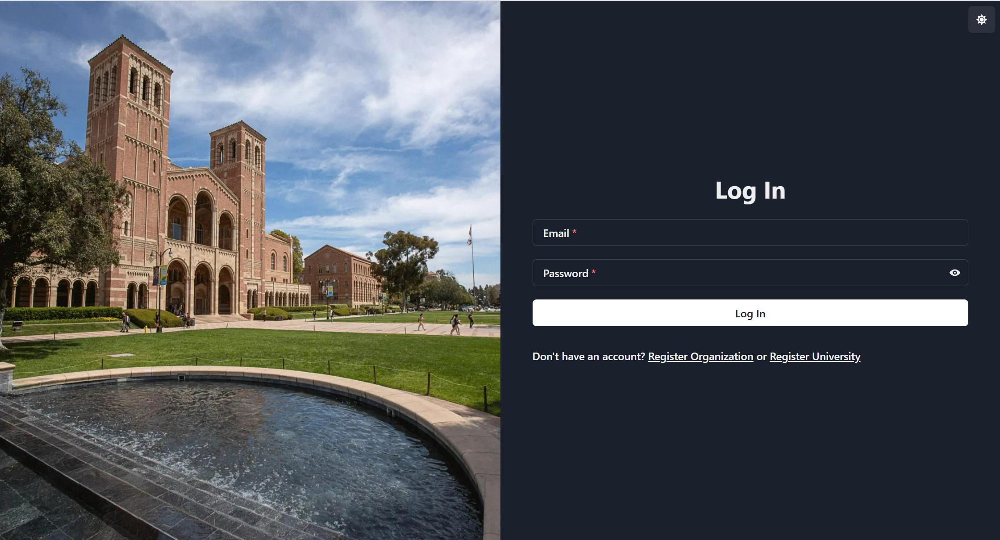
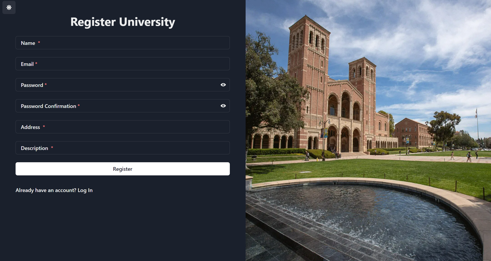
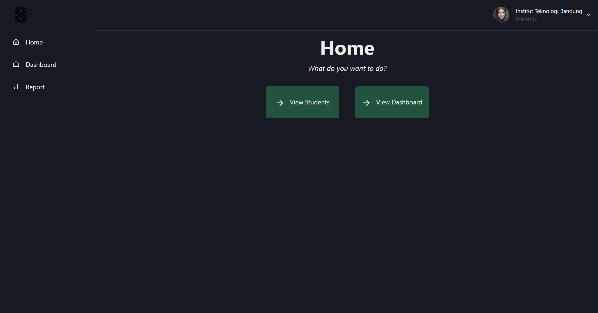
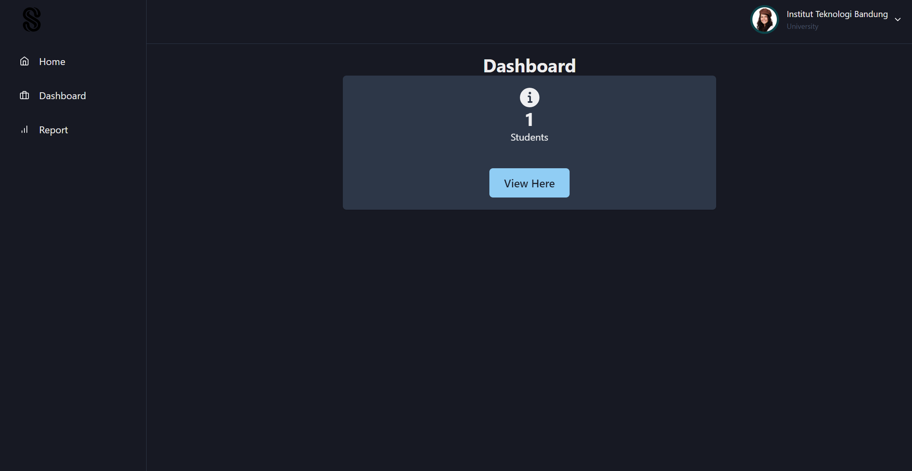
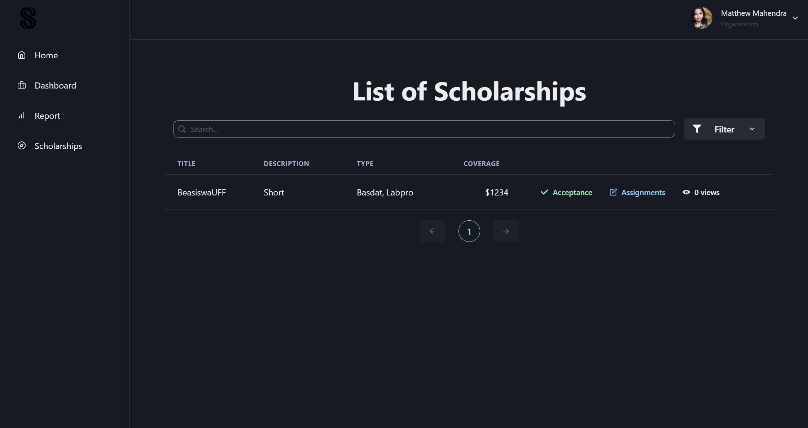
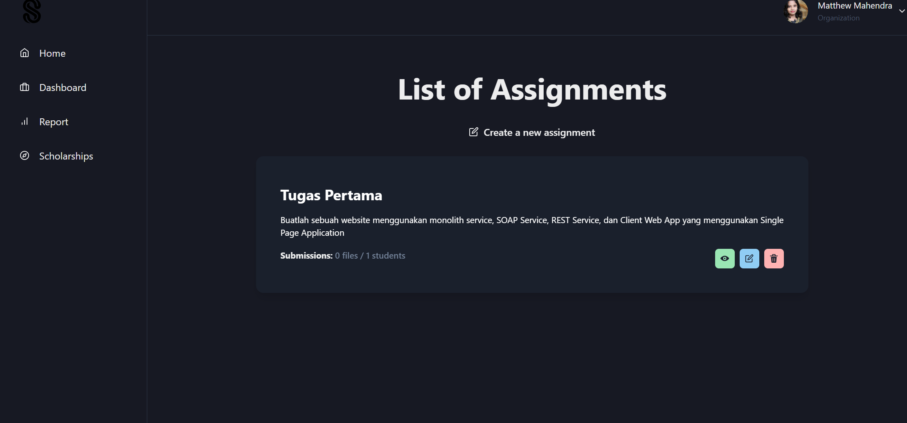
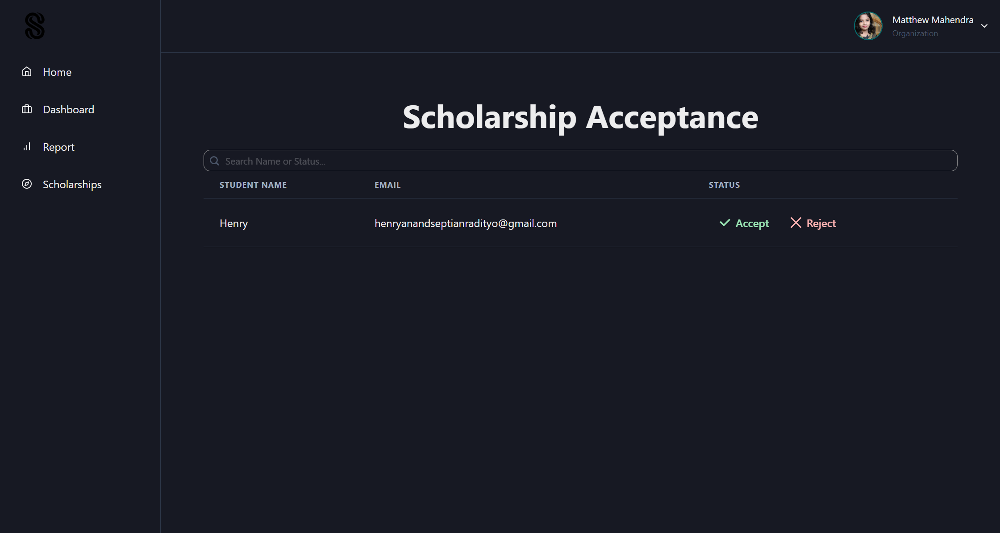
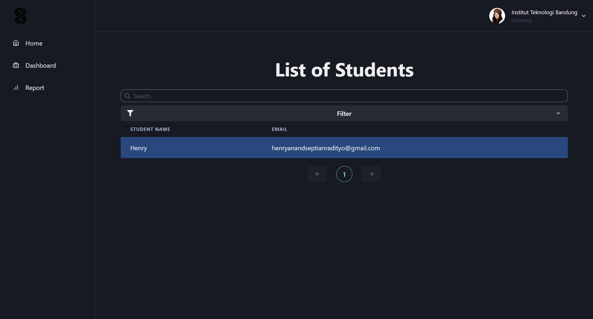

# Client WebApp

## About
A client web-application for the Scholee Website. Here, it can be used to view submissions, create scholarship assignments, set scholarship acceptance. Also, for universities, you can view your students who have used this website.

Created using React Typescript.

## Prerequisite
1. Node JS minimal version 18
2. Yarn

## How to Run
1. Setup your `.env` using `.env.example`

2. Install the yarn module
```
yarn install
```

3. Run the web application
```
yarn start
```

## Pages
### Login Page


### Register Page


### Home Page


### Dashboard


### Scholarship Report Page


### Assignment Page


### Scholarship Acceptance Page


### University Report Page



## Contributors
| Functionalities | 13521004   | 13521007 | 13521024 |
| --------------- | :--------: | :------: | :------: |
| Setup           |            |          |  &check; |
| Login/Register  | &check;    |          |          |
| Home Page       | &check;    |          |          |
| Dashboard       |            |  &check; |          |
| Assignment      |            |          |&check;   |
| Submission      | &check;    |          |          |
| Scholarship List |           |          | &check;  |
| Report          |            |&check;   |          |
| Scholarship Acceptance |     | &check;  | &check;  |
| Student Lists   |            | &check;  | &check;  |
| Authentication  |  &check;   |          |          |