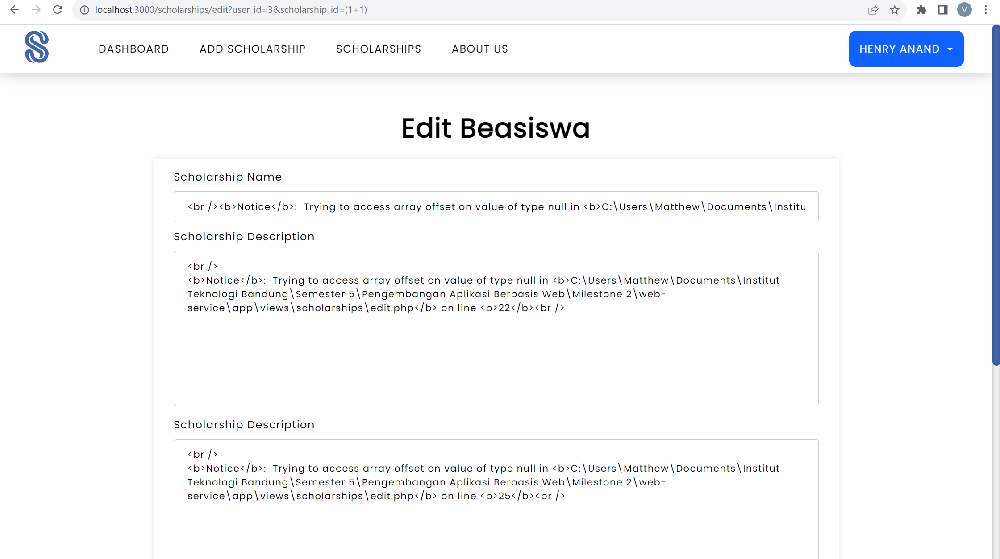
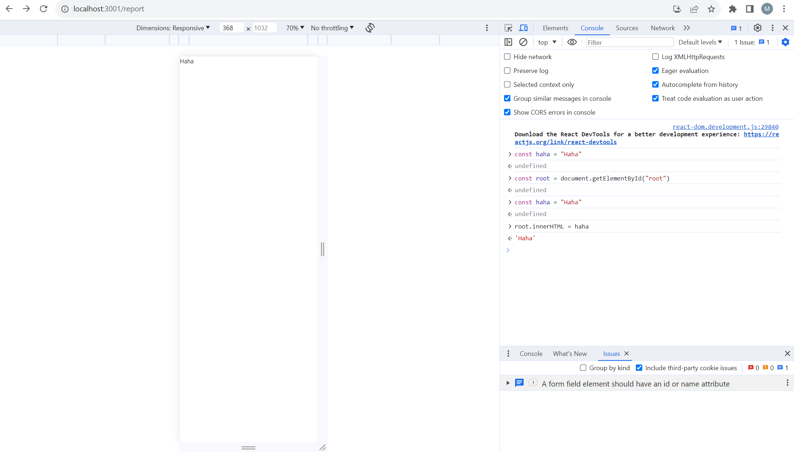
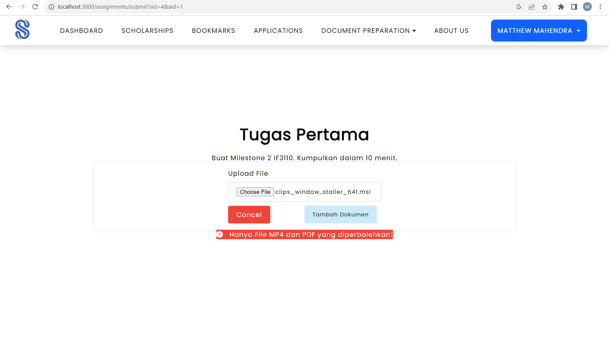
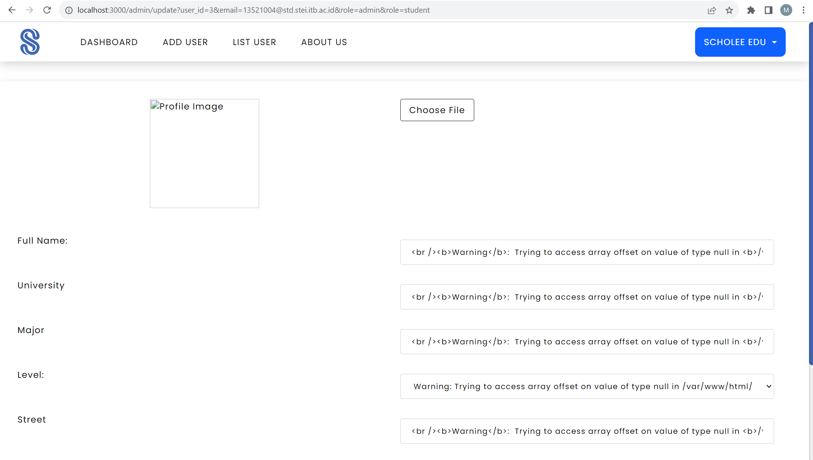
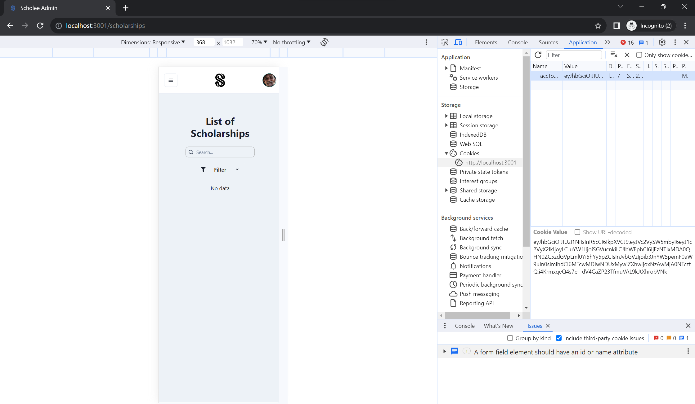

# Client WebApp

## About
A client web-application for the Scholee Website. Here, it can be used to view submissions, create scholarship assignments, set scholarship acceptance. Also, for universities, you can view your students who have used this website.

Created using React Typescript.

## Prerequisite
1. Node JS minimal version 18
2. Yarn

## How to Run
1. Setup your `.env` using `.env.example`

2. Install the yarn module
```
yarn install
```

3. Run the web application
```
yarn start
```

## Pages
### Login Page


### Register Page


### Home Page


### Dashboard


### Scholarship Report Page


### Assignment Page


### Scholarship Acceptance Page


### University Report Page


## OWASP Analysis
OWASP is a online community that focuses on building secure web applications by providing articles, methodologies, documentation, tools, and technologies.

We will discuss security risk that might happen
1. SQL Injection

SQL Injection is the process of getting data with injecting a SQL query to the backend service. SQL Injection can be prevented using ORM databases or preparing queries before execution. In our REST we have implemented ORM so it is impossible to do such attack because queries are done using function instead of raw queries. In our Monolith and SOAP Service, we prepared all statements before executing as such queries are validated before executing.

We give the example of trying to inject an SQL Query on the Monolith Application



As we can see it does not return the data of id 2 when trying to inject scholarship_id = (1+1).

2. HTML and CSS Injection

HTML and CSS injection is injecting CSS and or HTML to a web page to change the visuals and permanently add them. HTML CSS injection in our website context is editing the scholarship acceptance status in the acceptance page. Both the SPA and Monolith Service use backend validation for Acceptance Status, so it is not possible to change database using HTML and CSS injection only.

We give example of trying to inject HTML and CSS on the Client Webapp



We manage to inject with a const. However, since the variable isn't saved, the page can be reloaded to it's normal state.


3. File Upload Vulnerabilities

File Upload Vulnerabilities is uploading file that could potentially harm the object storage where we store our datas, such as deleting the datas, uploading malwares, or uploading a very large file that could flood the object storage. This is prevented using file types validation, in our website, we only allow .mp4 and .pdf files and also validate the maximum file size.

We give example of trying to inject a potentially malicious file on assignments page



We tried to upload a `.msi` file, because the application only allows to upload pdf and mp4, the application blocks the process.

4. HTTP Parameter Pollution

Parameter pollution could lead to various attacks such as SQL Injection by polluting the paramaters given in a HTTP request. For example, adding a parameter to the base URL of a page request that will result in breaking the business process contained in the database.

We give example of polluting by adding another parameter that could break the business processing



The page simply goes into error.

5. JWT / OAuth Attack

JWT Attack is a weakness that when an attacker steals a user credentials and use it to gain access to the website using that user's credentials. JWT Attack could be done by stealing the token from a user and using it. JWT Attack could be prevented by using short termed Access Tokens and a HTML Only Refresh Token. Short termed access tokens are used for users to gain access and stored in the Cookies. Access Tokens are very vulnerable to be acquired by an attacker, so we use short term expiration which expires every 1 minute. The refresh token are HTML Only and secure so attacker couldn't gain it easily and it is unique to each users and stored in the database. Everytime the access tokens is expired, we gain a new one using our refresh token. So, let's say an attacker gains a access token, the attacker could only use it for 1 minute, after that, it will expire and they couldn't gain a new one because they don't have a refresh token.

We will try to login, get the token, and access it from an incognito page.



We are able to login, but only able to access it for a few minutes before being forced to logout.

## Contributors
| Functionalities | 13521004   | 13521007 | 13521024 |
| --------------- | :--------: | :------: | :------: |
| Setup           |            |          |  &check; |
| Login/Register  | &check;    |          |          |
| Home Page       | &check;    |          |          |
| Dashboard       |            |  &check; |          |
| Assignment      |            |          |&check;   |
| Submission      | &check;    |          |          |
| Scholarship List |           |          | &check;  |
| Report          |            |&check;   |          |
| Scholarship Acceptance |     | &check;  | &check;  |
| Student Lists   |            | &check;  | &check;  |
| Authentication  |  &check;   |          |          |